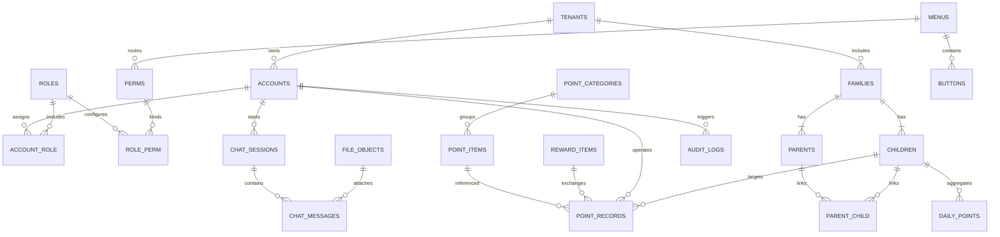

# ER 模型（多租户 + 审计字段）

以下模型覆盖核心主体、积分业务、AI/OCR 以及审计需求。每张表默认包含字段：
- `id` (BIGINT UNSIGNED, 主键)
- `tenant_id` (BIGINT UNSIGNED, 平台级表可选 `NULL`)
- `is_deleted` (TINYINT, 默认 0)
- `created_by`、`created_at`、`updated_by`、`updated_at`

## 表说明摘要

- **tenants**：租户主数据（名称、联系人、状态、套餐）。
- **accounts**：账号信息，标识家长/管理端账号，含登录凭证哈希、角色关系。
- **roles / perms / role_perm / account_role**：RBAC 体系，`perms` 支持菜单、按钮、接口编码。
- **menus / buttons**：前端菜单与按钮资源，绑定 `perms` code。
- **families / parents / children / parent_child**：家庭与家长、孩子的多对多模型，便于一个家长关联多个孩子。
- **point_categories / point_items / reward_items / point_records / daily_points**：积分类别、项目、兑换项与积分流水、日汇总。
- **chat_sessions / chat_messages**：AI 聊天上下文与消息记录，关联附件 `file_objects`。
- **file_objects**：对象存储记录（MinIO key、类型、大小、预签名有效期）。
- **audit_logs**：审计日志，覆盖登录、权限、积分、导出等事件。

该模型满足多租户共享表，同时保留平台级全局配置（允许 `tenant_id` 为空）。
